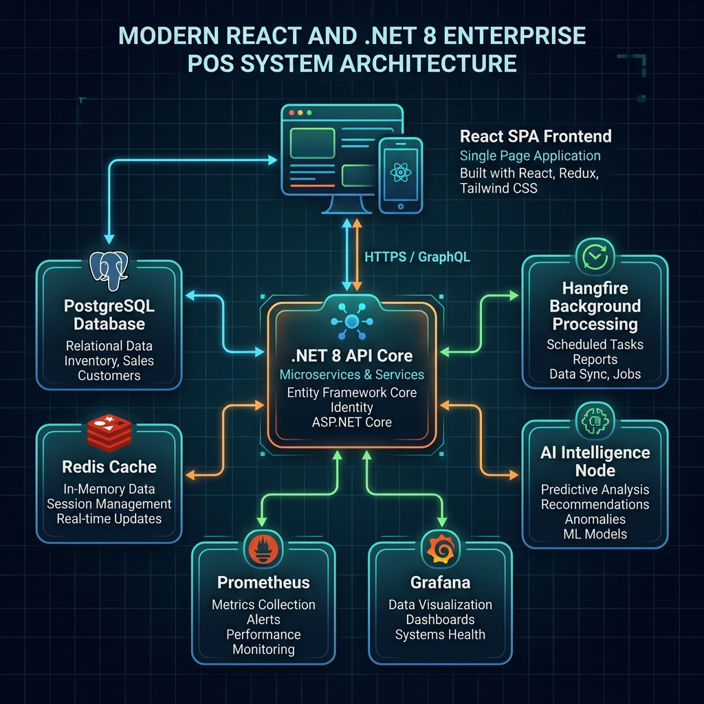
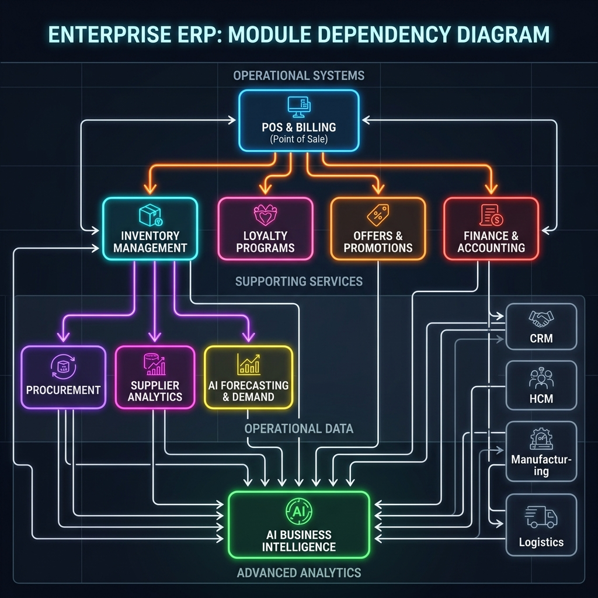
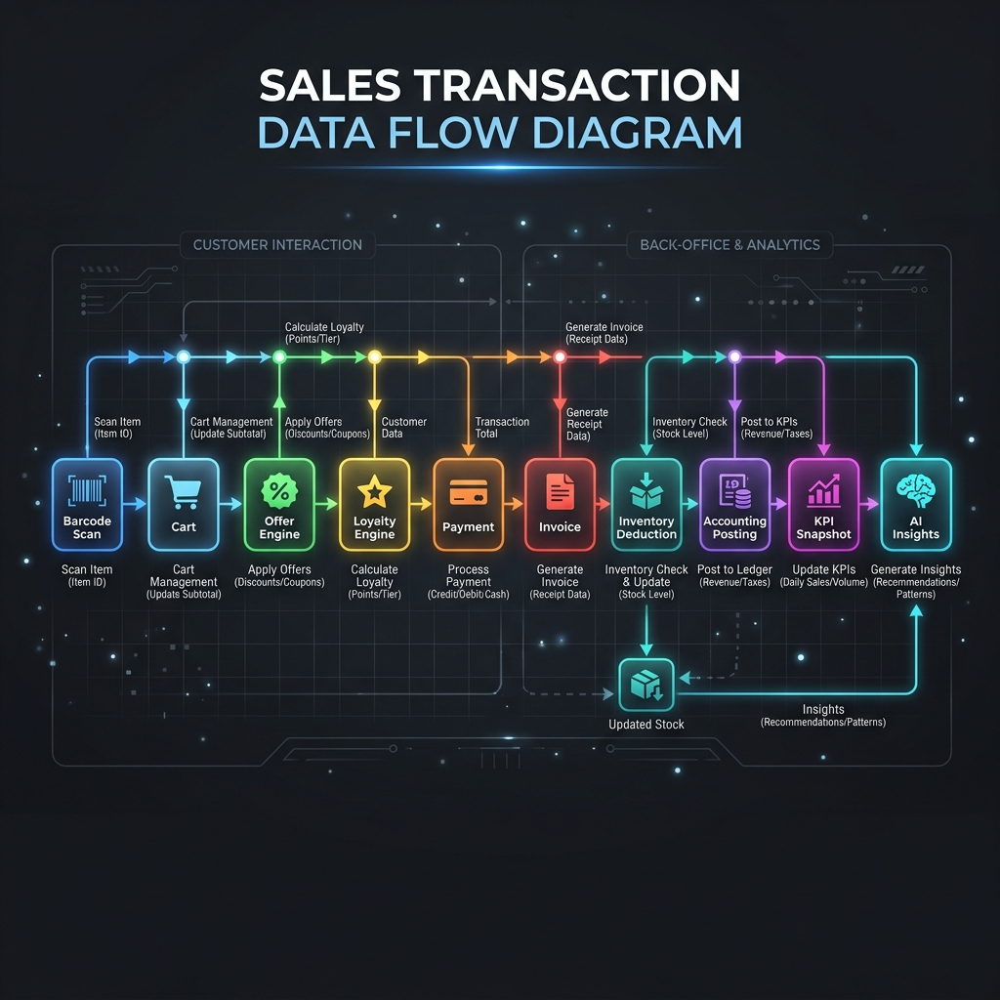
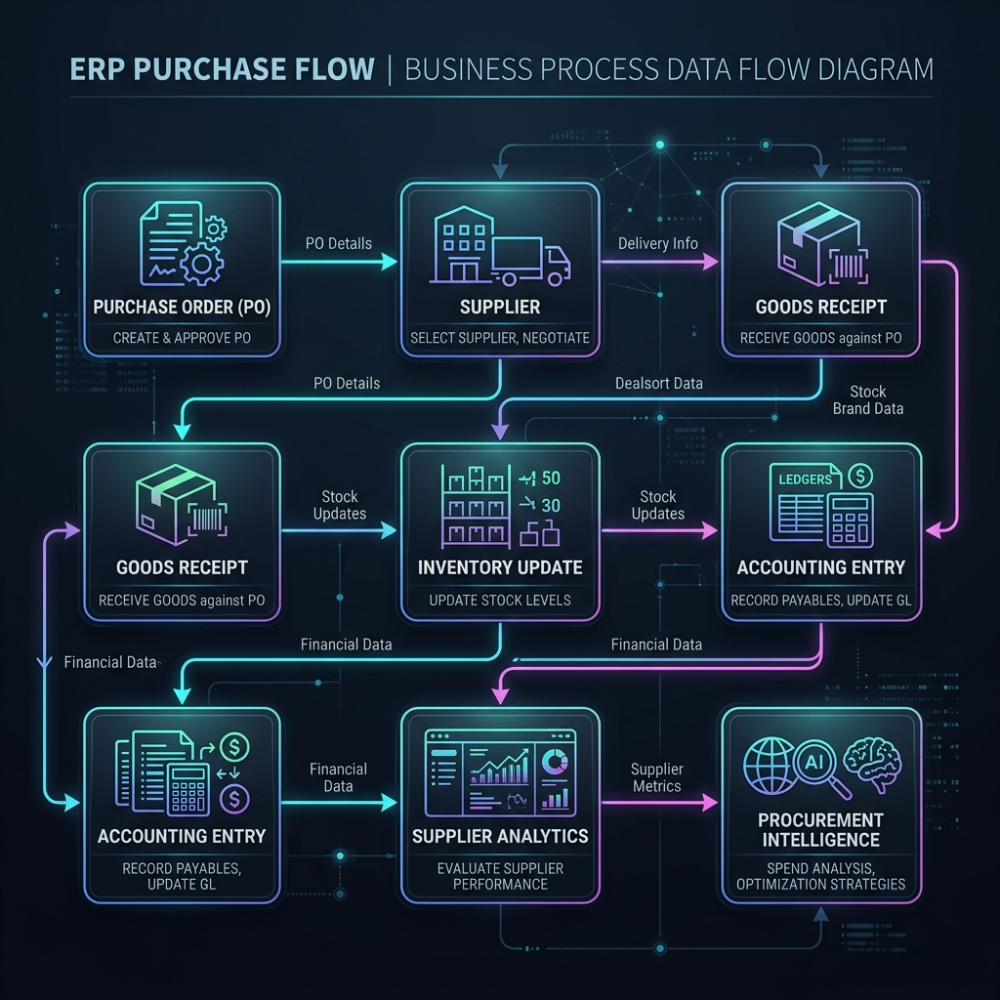
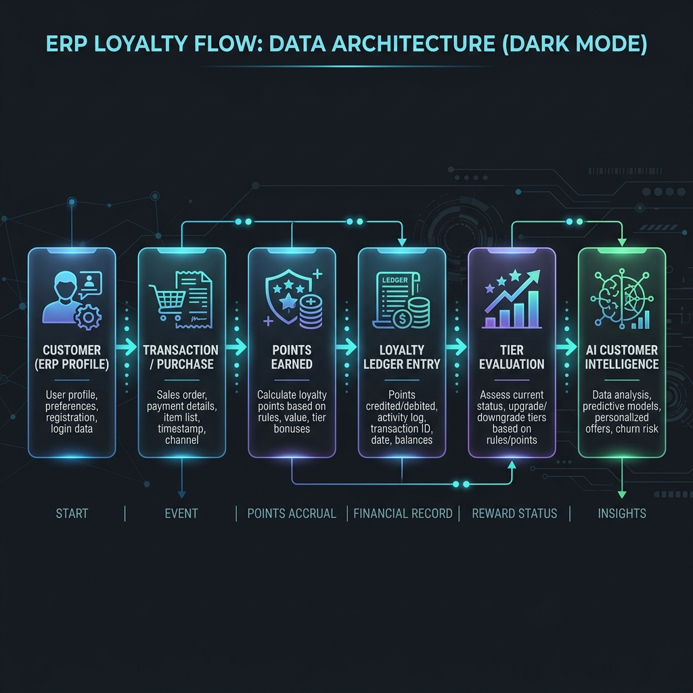
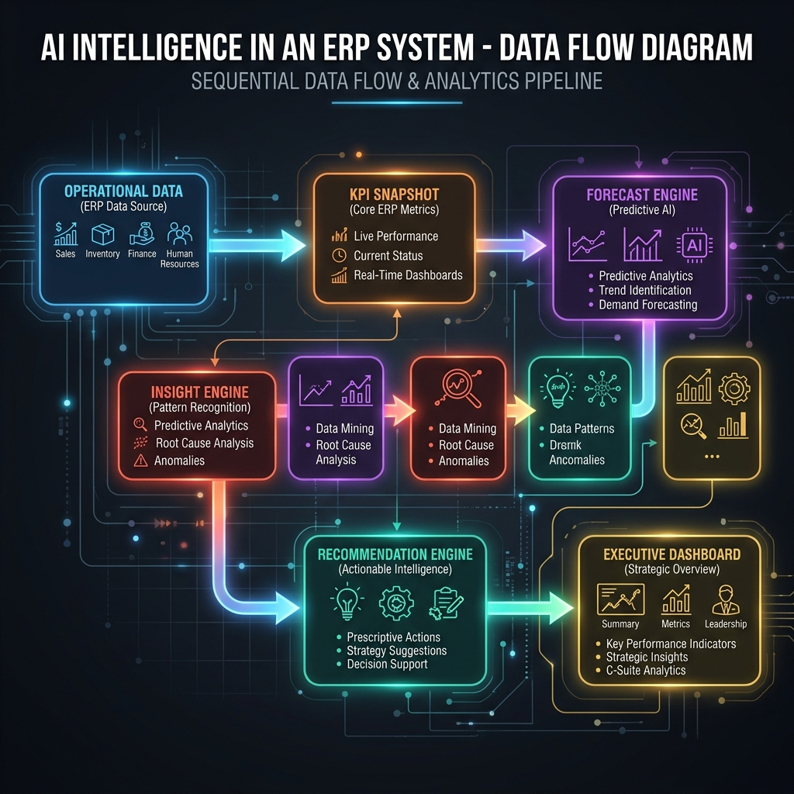
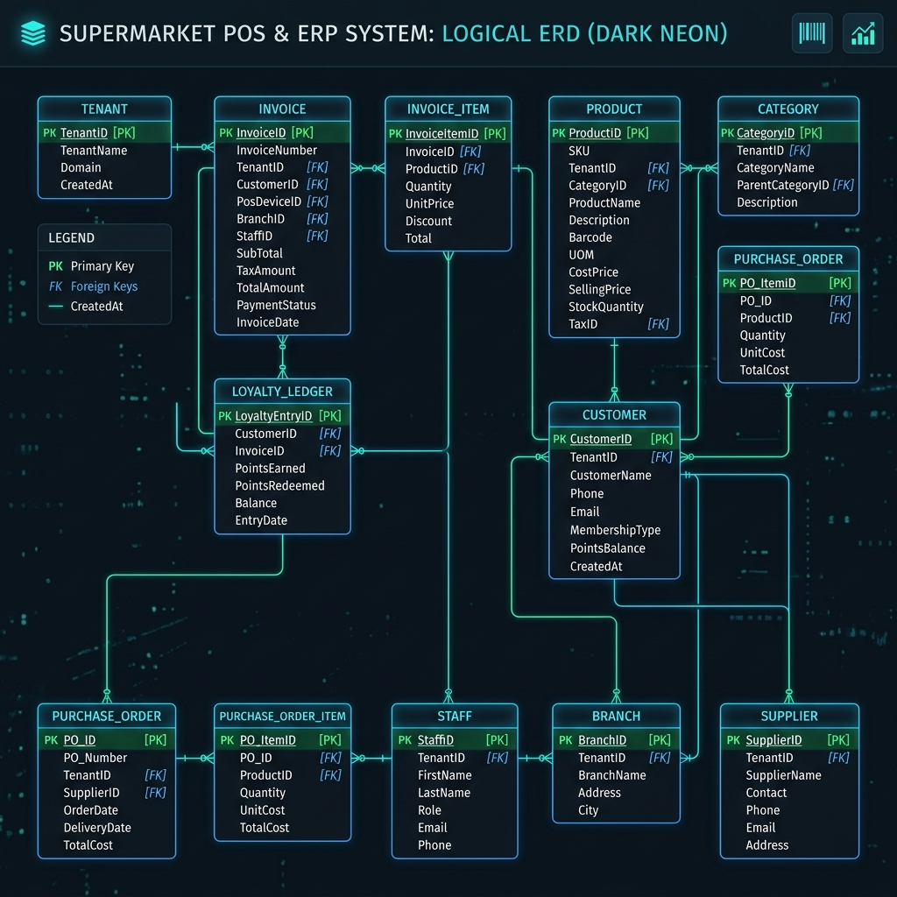

# Apple Supermarket ERP & POS Platform
# Master System Architecture Document
**Version 1.0 Final**

## Table of Contents
1. [Executive Overview](#1-executive-overview)
2. [System Architecture Diagram](#2-system-architecture-diagram)
3. [Module Dependency Architecture](#3-module-dependency-architecture)
4. [Business Process Data Flows](#4-business-process-data-flows)
5. [Complete ER Diagram](#5-complete-er-diagram)
6. [Database Entity Catalog](#6-database-entity-catalog)
7. [API Inventory Summary](#7-api-inventory-summary)
8. [Architecture Decision Records (ADR)](#8-architecture-decision-records-adr)
9. [Authentication & Security Architecture](#9-authentication--security-architecture)
10. [Multi-Tenant Architecture](#10-multi-tenant-architecture)
11. [Background Job Architecture](#11-background-job-architecture)
12. [AI Architecture](#12-ai-architecture)
13. [Infrastructure Architecture](#13-infrastructure-architecture)
14. [Deployment Sizing Guide](#14-deployment-sizing-guide)
15. [Monitoring & Observability](#15-monitoring--observability)
16. [Reliability & Disaster Recovery](#16-reliability--disaster-recovery)
17. [Version History](#17-version-history)
18. [Future Roadmap](#18-future-roadmap)

---

## 1. Executive Overview

### System Purpose
The Apple Supermarket ERP & POS Platform is an enterprise-grade, cloud-ready software suite designed to unify front-of-house Point of Sale (POS) operations with robust back-office Enterprise Resource Planning (ERP).

### Business Objectives
- Automate procurement based on AI forecasting.
- Eliminate POS downtime through heavy caching and resilient architectures.
- Unify customer loyalty and omnichannel promotions.
- Provide actionable, predictive intelligence to executives.

### Technology Stack
- **Frontend**: React (TypeScript, Vite), TailwindCSS, Recharts.
- **Backend Core**: .NET 8, C#, Entity Framework Core.
- **Persistence**: PostgreSQL 16.
- **Caching**: Redis 7.
- **Background Jobs**: Hangfire.
- **Observability**: OpenTelemetry, Prometheus, Grafana.

---

## 2. System Architecture Diagram

### Description
The system follows a strict Client-Server architecture. The Nginx reverse proxy routes UI traffic to the React SPA container and API traffic to the .NET 8 Backend container.

---

## 3. Module Dependency Architecture

### Description
The modular monolith is structured to isolate domain boundaries while allowing tight transactional coupling where performance dictates.

- **POS & Billing**: Depends on Inventory (for stock checks), Loyalty (for point accruals), Offers (for price overrides), and Finance (for GL postings). Without these, offline mode engages, storing transactions in Redis until connectivity restores.
- **Inventory Intelligence**: Depends on Procurement (Supplier PO generation) and AI Forecasting (Demand Prediction).
- **AI Business Intelligence**: Acts as the apex consumer, synthesizing operational data across all lower modules to generate Executive Dashboards.

---

## 4. Business Process Data Flows

### Sales Transaction Flow

**Explanation:** A cashier scans a barcode. The item enters the Cart, triggering the Offer Engine to evaluate BOGO or Percent rules. The Loyalty Engine attaches the Customer. Payment clears, generating an Invoice. Background events subsequently deduct Inventory, post Accounting ledgers, and feed AI models.

### Purchase Flow

**Explanation:** The AI Engine generates a Reorder Recommendation based on EOQ. A Manager converts this to a Draft Purchase Order. The Supplier fulfills the order, triggering a Goods Receipt Note (GRN), which increments Inventory and feeds Supplier Fill-Rate Analytics.

### Loyalty Flow

**Explanation:** Customer purchases yield Points Earned. These are logged immutably in the Loyalty Ledger. Monthly Hangfire jobs evaluate total spend, promoting or demoting Customer Tiers, feeding into Churn Risk predictions.

### AI Intelligence Flow

**Explanation:** Operational Data is snapshotted nightly. The Forecast Engine predicts demand, while the Insight Engine flags anomalies (e.g., Dead Stock). The Recommendation Engine prescribes actions, surfacing to the Executive Dashboard.

---

## 5. Complete ER Diagram

### Description
The normalized relational structure pivots entirely around the `Tenant` entity. Core tables (`Product`, `Invoice`) utilize composite keys or explicit FK relationships ensuring strict data integrity.

---

## 6. Database Entity Catalog

*A comprehensive tabular reference is available in `Database_Entity_Catalog.xlsx`.*

| Table Name | Module | Purpose | Tenant Scoped | Audit Required |
| :--- | :--- | :--- | :--- | :--- |
| `Store` | Core | Physical Location | Yes | Yes |
| `Invoice` | POS | Sales Header | Yes | Yes |
| `LoyaltyLedgerEntry` | CRM | Immutable point history | Yes | Yes |
| `ProductStoreInventoryPolicy`| Inventory | Reorder & EOQ Rules | Yes | Yes |
| `SupplierScorecard` | Procurement | Fill rate analytics | Yes | No |
| `AiBusinessInsight` | AI | Actionable analytics | Yes | Yes |

---

## 7. API Inventory Summary

*A comprehensive API definition is available in `API_Catalog.xlsx`.*

### API Statistics
- **Total Controllers**: 12
- **Total Endpoints**: 48
- **Anonymous Endpoints**: 2 (Login, Refresh Token)
- **Owner-only Endpoints**: 6 (Executive Dashboards)
- **Cashier Endpoints**: 4 (Checkout, Cart Management)

### Groups
- `AuthController`: JWT Lifecycle.
- `PosController`: High-throughput cart processing.
- `InventoryController`: Stock management & adjustments.
- `LoyaltyController`: Point accruals and redemptions.

---

## 8. Architecture Decision Records (ADR)

### ADR-001: Modular Monolith Architecture
- **Decision**: Build a single .NET 8 application with strict internal namespaces rather than microservices.
- **Reason**: Eliminates distributed transaction complexity and reduces on-premise infrastructure requirements for supermarkets without dedicated IT staff.
- **Benefits**: Faster deployment, simplified debugging, unified Entity Framework context.
- **Risks**: Codebase coupling (mitigated via strict Interface usage).

### ADR-002: PostgreSQL
- **Decision**: Standardize on PostgreSQL 16.
- **Reason**: Unmatched JSONB support essential for dynamic AI rules and Promotion configurations.
- **Benefits**: High performance, open-source, ACID compliant.

### ADR-003: Redis Cache
- **Decision**: Integrate Redis for POS Carts.
- **Reason**: PostgreSQL cannot handle sub-50ms writes during peak billing hours without deadlocking.
- **Benefits**: POS can hold and resume carts instantly.

### ADR-004: TenantId-Based Multi-Tenancy
- **Decision**: Global `TenantId` column instead of separate databases.
- **Reason**: Simplifies AI aggregation across multiple stores for the Owner.
- **Benefits**: Single schema migration, easier multi-store reporting.

---

## 9. Authentication & Security Architecture

### RBAC Permission Matrix
| Operation | Cashier | Manager | Owner |
| :--- | :--- | :--- | :--- |
| **Sales Checkout** | Create | Create, Void | Read |
| **Inventory GRN** | None | Create, Approve | Read |
| **AI Insights** | None | Update (Action) | Delete, Resolve |

### Controls
- **Rate Limiting**: `PosApi` (100/s), `AiApi` (20/s), `AuthApi` (5/s).
- **Audit Logging**: `TenantId`, `UserAgent`, and `IP Address` captured via middleware for all `[HttpPost]` and `[HttpDelete]` actions.

---

## 10. Multi-Tenant Architecture

Enforced via Entity Framework Core Global Query Filters bound to an `ITenantProvider` extracting claims from the JWT. 
> [!WARNING] 
> Cross-tenant data leaks are impossible at the repository layer due to the `modelBuilder.Entity<T>().HasQueryFilter(e => e.TenantId == _tenantProvider.TenantId);` assertion.

---

## 11. Background Job Architecture

*A comprehensive schedule is available in `Background_Jobs_Catalog.xlsx`.*
- **InsightGenerationJob**: Daily (01:00 AM). Auto-heals on failure.
- **TierEvaluationJob**: Monthly (1st, 03:00 AM). Upgrades VIP customers.
- **AlertGenerationJob**: Hourly. Flags Expiry/Dead Stock risks.

---

## 12. AI Architecture
- `IInsightEngine`: Retrospective analysis.
- `IForecastEngine`: Forward demand modeling.
- `IRecommendationEngine`: Prescriptive procurement generation.

---

## 13. Infrastructure Architecture
Docker Compose handles the entire stack.
- Nginx acts as the Edge Router, terminating SSL.
- Data volumes (`postgres_data`, `redis_data`) are mapped to the host to ensure persistence during container updates.

---

## 14. Deployment Sizing Guide

| Store Size | Specs | Hardware Recommendation |
| :--- | :--- | :--- |
| **Small** | 1-2 POS, 5K SKUs | Intel i5, 16GB RAM, 256GB SSD |
| **Medium** | 3-10 POS, 25K SKUs | Intel i7, 32GB RAM, 512GB SSD |
| **Large / Multi-Store** | 10+ POS, 50K SKUs | Cloud Kubernetes (AWS/Azure) or Enterprise Server Rack (Dual Xeon, 64GB+ RAM, RAID 10 SSD) |

---

## 15. Monitoring & Observability
- **OpenTelemetry**: Integrated directly into ASP.NET middleware.
- **Prometheus / Grafana**: Local time-series metric scraping preventing cloud licensing fees while providing deep visibility into API Latency, CPU/Memory, and Hangfire queue depths.

---

## 16. Reliability & Disaster Recovery
- **Polly Resilience**: External API calls wrapped in Exponential Backoff Retries and Circuit Breakers.
- **RPO**: 15 Minutes (Cron `pg_dump`).
- **RTO**: 1 Hour (Automated `db_restore.sh` execution).

---

## 17. Version History
- **Phase 1-2**: Foundation, Auth, and Catalog mapping.
- **Phase 3**: CRM, Loyalty Tiers, and Offer Engine creation.
- **Phase 4**: Inventory Intelligence and Automated Procurement.
- **Phase 5**: Executive Dashboards and AI Insight Lifecycles.
- **Phase 6**: Enterprise Hardening (Security, Resilience, Multi-Tenancy).

---

## 18. Future Roadmap
- **WhatsApp/SMS Integration**: Automated receipt and loyalty updates.
- **AI Copilot**: Conversational LLM interfacing with the Database.
- **Supplier Portal**: Direct vendor access to acknowledge POs.
