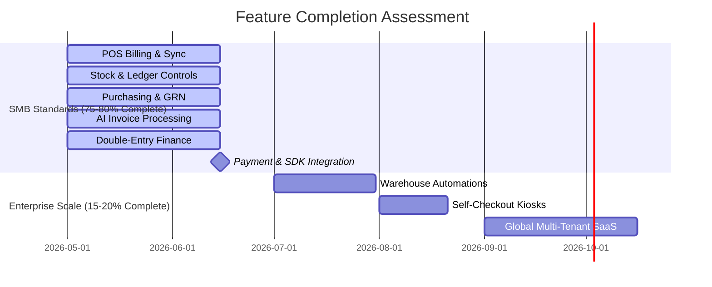
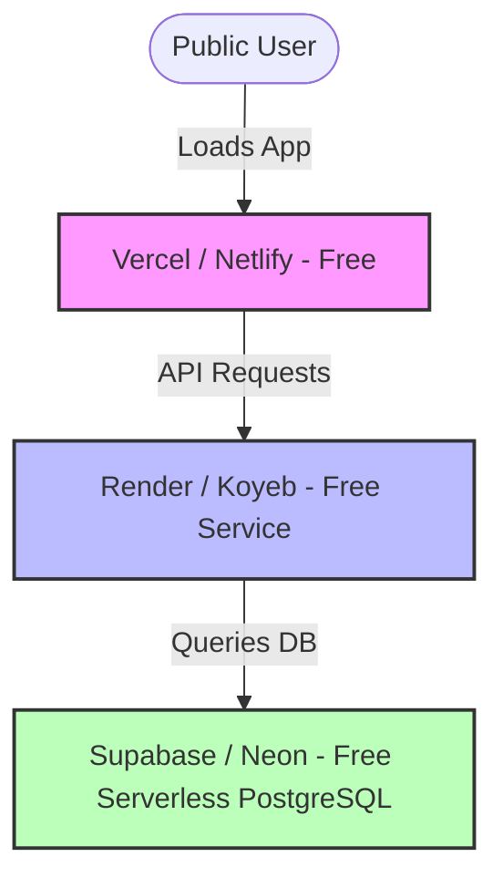

# Business Evaluation & Cloud Deployment Report

This report provides a detailed analysis of the **Supermarket POS & ERP System**, assessing its readiness, target markets, pricing models, and how to host a public demo environment at no cost.

---

## 1. Product Completion Analysis (vs. Enterprise Standards)

To accurately evaluate the system's completion rate, we look at two distinct benchmarks: **Enterprise Global Scale (e.g., Walmart)** and **SMB Supermarket Standard (e.g., Lightspeed, Vyapar, Marg ERP)**.

### Benchmarks
1. **VS. SMB Supermarket Standards (Target: Independent Grocers & Small Chains)**
   * **Completion Level: 75% – 80%**
   * **Reasoning**: The application includes all core requirements of a retail outlet: inventory ledgering, point of sale transactions, supplier ordering, GRN invoice extraction, basic CRM loyalty programs, and accounting.
2. **VS. Global Enterprise Standards (e.g., Walmart POS / ERP)**
   * **Completion Level: 15% – 20%**
   * **Reasoning**: Walmart-scale systems integrate advanced logistics, automated warehouse robots, complex Electronic Data Interchange (EDI) systems with thousands of suppliers, global localization (handling currency/tax compliance rules for 50+ countries), scale calibration, self-checkout kiosks, and high-availability offline-first databases spanning thousands of physical terminals simultaneously.

---

## 2. Feature Coverage: What is Built vs. What is Next

Below is a roadmap of what has been implemented and what remains to turn the system into a commercially sellable software product.

| Feature Area | Covered (Completed) | Missing (To Build / Commercialize) |
| :--- | :--- | :--- |
| **POS Billing** | • Offline caching and sync capabilities. • Cart, custom discounts, and receipt printing. • Terminal management & Manager PIN protection. | • Integrated credit card terminal endpoints (Ingenico/Verifone). • Scan-and-go mobile POS interface. |
| **Inventory** | • Materialized Stock Position reports. • Double-entry Stock Ledger. • Stock Take sheets with approval flow. • Expiry & Batch tracking. | • Automated low-stock trigger notifications. • Warehouse routing / barcode printing layouts. |
| **Purchasing** | • Supplier Master Profile. • Purchase Order approvals. • Goods Receipt Note (GRN) generation. | • Supplier credit notes and return flows. • Purchase contract negotiation tracking. |
| **AI Features** | • Automated GRN line-item extraction from supplier PDFs using LLM models. | • AI-based demand forecasting (predicting inventory replenishment schedules). |
| **Finance** | • Automated posting of invoices/GRN to Chart of Accounts (Journal Entries). | • Automated GST-1/3B filing export formats (India) or VAT-201 (UAE). |

---

## 3. Market Valuation & Pricing (Global Comparison)

We recommend a **SaaS Subscription Model (Software-as-a-Service)** alongside a **One-Time License Option** with an annual maintenance charge (AMC). 

### Price List by Region

| Region | Monthly SaaS (per Store) | Annual SaaS (per Store) | One-Time Enterprise License | Local Competitors |
| :--- | :--- | :--- | :--- | :--- |
| **India** | ₹1,500 – ₹3,000 | ₹15,000 – ₹30,000 | ₹45,000 – ₹90,000 *(+15% AMC)* | Marg ERP, Vyapar, Retail ERPs |
| **Singapore** | SGD $75 – SGD $150 | SGD $750 – SGD $1,500 | SGD $2,000 – SGD $4,500 | Lightspeed, Vend, Shopify POS |
| **UAE** | AED 200 – AED 450 | AED 2,000 – AED 4,500 | AED 6,000 – AED 12,000 | Tally Prime, Focus Softnet |
| **U.K.** | £50 – £120 | £500 – £1,200 | £1,500 – £3,500 | EPOS Now, Lightspeed Retail |

> [!TIP]
> **Localization is Key**: In India, market the **GST compliance & AI Invoice Reader**. In Singapore, position it for **IMDA productivity grants** (PSG). In UAE/UK, highlight the **easy VAT journal entry posting**.

---

## 4. Market Penetration Strategy

The primary countries to target for selling this application are grouped by market entry difficulty:

1. **Primary Target (India)**:
   * *Why*: The AI Invoice Extractor is extremely valuable for Indian shopkeepers who receive hundreds of physical invoices weekly from local distributors. Direct support for GST/HSN mapping makes it highly competitive.
2. **Secondary Targets (UAE & Singapore)**:
   * *Why*: High density of small-to-medium retail shops, high purchasing power, clear VAT systems, and active government digital adoption grants (PSG in Singapore).
3. **Tertiary Targets (UK / Europe)**:
   * *Why*: A mature market with high margins, but requires robust integrations with local merchant card processors (Adyen, Stripe, SumUp) and Strict GDPR compliance.

---

## 5. Free Cloud Deployment Guide (Public Demo environment)

To provide business leads a public, restricted demo without recurring infrastructure costs, deploy the following architecture:

### Step-by-Step Hosting Setup
1. **Frontend Hosting (Vercel / Netlify)**:
   * *Cost*: $0 (Free Tier)
   * *Action*: Link your GitHub repository. Vercel automatically builds and deploys the Vite project and provides a free SSL domain (e.g., `https://my-pos-demo.vercel.app`).
2. **Backend API Hosting (Render.com or Koyeb)**:
   * *Cost*: $0 (Free Tier Web Service)
   * *Action*: Deploys the ASP.NET Core API from your `backend.Dockerfile`.
   * *Note*: Free services spin down when idle, meaning the first API request after some time may take 30-50 seconds to boot.
3. **Database Hosting (Supabase or Neon.tech)**:
   * *Cost*: $0 (Free Serverless PostgreSQL)
   * *Action*: Creates a cloud database instance and provides the connection string to configure in the Render backend settings.

### Implementing Demo Mode Restrictions
To protect the demo instance from vandalism, implement the following guardrails:
* **Database Reset (Cron Job)**: Run a scheduled job every 24 hours to wipe the tables and seed default products, sales, and accounts.
* **Write Restraints**: Disable key operations (like updating user passwords, modifying master system settings, or executing database purges) for users logged in with the credential `demo@supermarket.com`.
